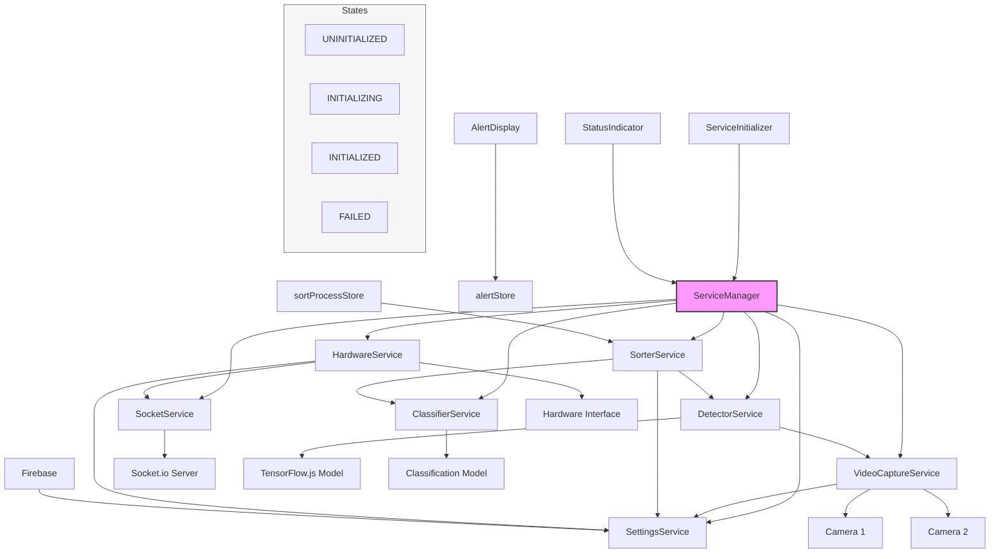
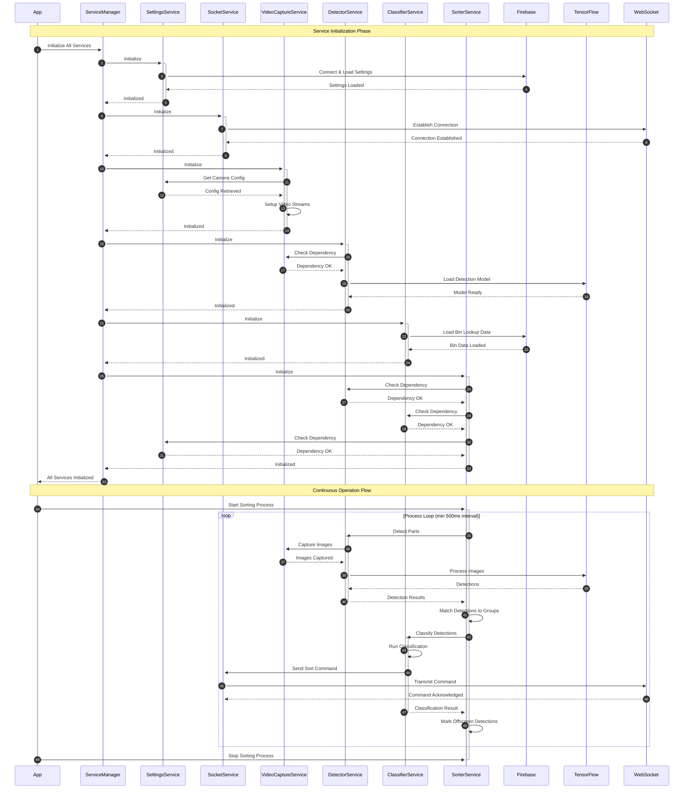
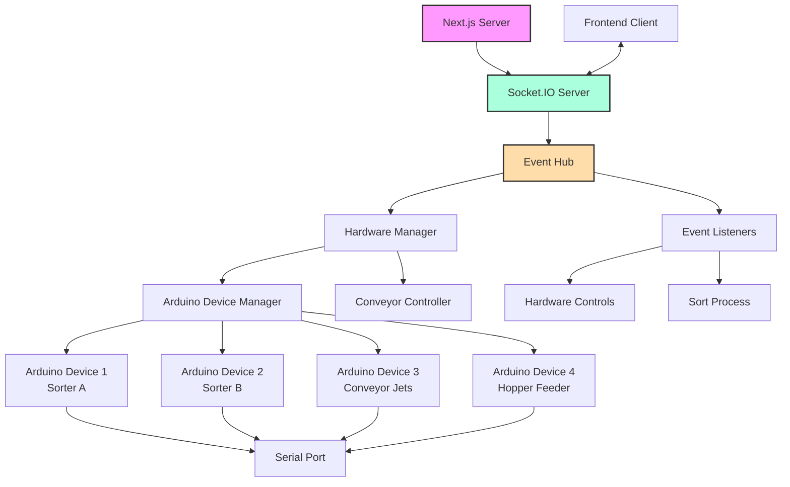
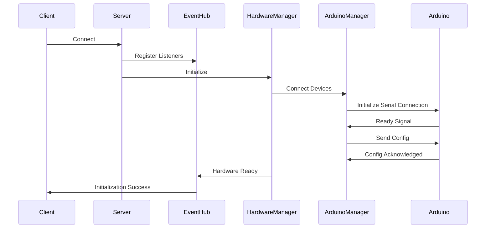
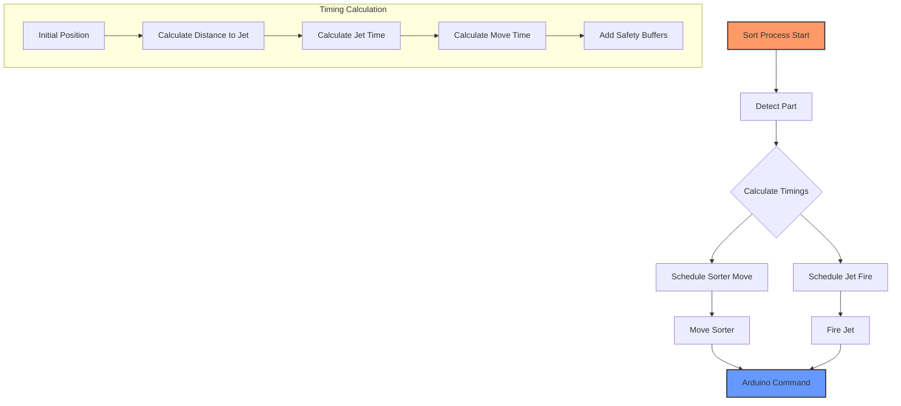
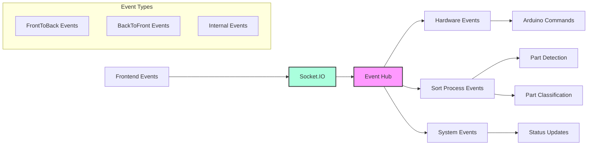

# Rebrick Sorter System Architecture

## Overview

The Rebrick Sorter is a sophisticated system designed to automatically detect, classify, and sort Lego bricks using computer vision and machine learning. The application is built using Next.js and follows a service-oriented architecture pattern.

## System Components

### Core Services

1. **ServiceManager**

   - Central hub that manages all service lifecycles
   - Handles initialization and state management of all services
   - Provides access to services throughout the application

2. **SettingsService**

   - Manages application settings
   - Integrates with Firebase for settings persistence
   - Provides configuration for other services

3. **SocketService**

   - Manages WebSocket connections using Socket.io
   - Enables real-time communication with hardware
   - Handles connection state and reconnection logic

4. **VideoCaptureService**

   - Controls dual camera system
   - Captures video streams from two cameras
   - Depends on SettingsService for camera configuration

5. **DetectorService**

   - Processes images to detect Lego pieces
   - Uses TensorFlow.js for object detection
   - Depends on VideoCaptureService for image input

6. **ClassifierService**

   - Classifies detected Lego pieces
   - Integrates with machine learning model
   - Works in conjunction with DetectorService

7. **HardwareService**

   - Interfaces with physical sorting hardware
   - Depends on SocketService for communication
   - Depends on SettingsService for hardware configuration

8. **SorterService**
   - Controls the overall sorting process
   - Coordinates detection, classification, and hardware control
   - Depends on DetectorService, ClassifierService, and SettingsService

### UI Components

1. **ServiceInitializer**

   - Initializes all services on application startup
   - Manages service initialization sequence
   - Provides loading state during initialization

2. **StatusIndicator**

   - Displays real-time status of all services
   - Shows service states (UNINITIALIZED, INITIALIZING, INITIALIZED, FAILED)
   - Allows manual service reinitialization

3. **AlertDisplay**

   - Shows system alerts and notifications
   - Integrates with alertStore for state management

4. **NavBar**
   - Provides navigation and system controls
   - Displays system status

### State Management

- **alertStore**: Manages system alerts and notifications
- **sortProcessStore**: Controls sorting process state
- **Firebase**: Persists application settings
- **Service States**: Each service can be in one of four states:
  - UNINITIALIZED
  - INITIALIZING
  - INITIALIZED
  - FAILED

### External Integrations

1. **Machine Learning**

   - TensorFlow.js for object detection
   - Custom classification model for Lego piece identification

2. **Hardware Interface**
   - Socket.io server for real-time hardware communication
   - Dual camera system
   - Physical sorting mechanism

## System Architecture Diagram

### Frontend Services Flow

## Service Initialization Flow

1. **App initiates service initialization**: The ServiceInitializer component in the frontend application triggers the initialization of all services through the ServiceManager.

2. **ServiceManager begins SettingsService initialization**: The ServiceManager calls the init() method on the SettingsService, which is the first service to be initialized as other services depend on settings configuration.

3. **SettingsService connects to Firebase**: The service establishes a connection to Firebase Firestore to load user-specific settings.

4. **Firebase returns settings data**: Firebase responds with the user's stored settings configuration data.

5. **SettingsService completes initialization**: After successfully loading settings, the SettingsService updates its state to INITIALIZED and notifies the ServiceManager.

6. **ServiceManager begins SocketService initialization**: The ServiceManager proceeds to initialize the SocketService for real-time communication.

7. **SocketService establishes WebSocket connection**: The service connects to the WebSocket server using Socket.io.

8. **WebSocket connection confirmation**: The server acknowledges the connection establishment.

9. **SocketService completes initialization**: The SocketService updates its state to INITIALIZED and notifies the ServiceManager.

10. **ServiceManager begins VideoCaptureService initialization**: The ServiceManager moves on to initialize the video capture functionality.

11. **VideoCaptureService retrieves camera configuration**: The service requests camera settings from the SettingsService.

12. **SettingsService provides camera configuration**: The SettingsService returns the camera settings needed for initialization.

13. **VideoCaptureService sets up video streams**: The service initializes camera connections and configures video streams based on the settings.

14. **VideoCaptureService completes initialization**: After successfully setting up the video streams, the service updates its state to INITIALIZED and notifies the ServiceManager.

15. **ServiceManager begins DetectorService initialization**: The ServiceManager proceeds to initialize the object detection functionality.

16. **DetectorService verifies dependency**: The service checks if the VideoCaptureService is properly initialized.

17. **VideoCaptureService confirms readiness**: The VideoCaptureService confirms it is ready for the DetectorService to use.

18. **DetectorService loads TensorFlow model**: The service loads the TensorFlow.js object detection model from the specified location.

19. **TensorFlow model loaded**: The model is successfully loaded and ready for object detection.

20. **DetectorService completes initialization**: The DetectorService updates its state to INITIALIZED and notifies the ServiceManager.

21. **ServiceManager begins ClassifierService initialization**: The ServiceManager proceeds to initialize the part classification functionality.

22. **ClassifierService loads bin data from Firebase**: The service loads part-to-bin mapping data from Firebase.

23. **Firebase returns bin mapping data**: Firebase responds with the bin mapping configuration data.

24. **ClassifierService completes initialization**: After successfully loading the bin mapping data, the service updates its state to INITIALIZED and notifies the ServiceManager.

25. **ServiceManager begins SorterService initialization**: The ServiceManager proceeds to initialize the sort process controller.

26. **SorterService verifies DetectorService dependency**: The service checks if the DetectorService is properly initialized.

27. **DetectorService confirms readiness**: The DetectorService confirms it is ready for the SorterService to use.

28. **SorterService verifies ClassifierService dependency**: The service checks if the ClassifierService is properly initialized.

29. **ClassifierService confirms readiness**: The ClassifierService confirms it is ready for the SorterService to use.

30. **SorterService verifies SettingsService dependency**: The service checks if the SettingsService is properly initialized.

31. **SettingsService confirms readiness**: The SettingsService confirms it is ready for the SorterService to use.

32. **SorterService completes initialization**: The SorterService updates its state to INITIALIZED and notifies the ServiceManager.

33. **ServiceManager completes all initializations**: The ServiceManager notifies the App that all services are successfully initialized.

## Continuous Operation Flow

34. **App starts the sorting process**: The user initiates the sorting process via the UI, which calls the start() method on the SorterService.

35. **SorterService begins detection cycle**: The SorterService starts its process loop that runs at minimum 500ms intervals.

36. **SorterService requests part detection**: The service calls the detect() method on the DetectorService to identify Lego parts in the video stream.

37. **DetectorService requests images**: The DetectorService calls the captureImage() method on the VideoCaptureService to get current images from both cameras.

38. **VideoCaptureService captures and returns images**: The service captures frames from both cameras and returns them to the DetectorService.

39. **DetectorService processes images with TensorFlow**: The service sends the captured images to the TensorFlow model for object detection.

40. **TensorFlow returns detection results**: The model identifies objects in the images and returns bounding boxes and confidence scores.

41. **DetectorService returns detection pairs**: The service processes the raw detection results, pairs corresponding top and side view detections, and returns them to the SorterService.

42. **SorterService matches detections to groups**: The service tracks parts across frames by matching new detections to existing detection groups based on position and timing.

43. **SorterService requests part classification**: For detection groups that have moved to the classification zone, the service calls the classify() method on the ClassifierService.

44. **ClassifierService performs classification**: The service analyzes the detection images to determine the part type and ID.

45. **ClassifierService prepares sort command**: Based on the classification result, the service creates a sort command with the appropriate bin target.

46. **ClassifierService sends command via SocketService**: The service emits a SORT_PART event through the SocketService to initiate the physical sorting.

47. **SocketService transmits command to WebSocket**: The service forwards the sort command to the WebSocket server.

48. **WebSocket acknowledges command**: The server confirms receipt of the sort command.

49. **ClassifierService returns result to SorterService**: The service sends the classification result back to the SorterService for tracking.

50. **SorterService updates offscreen detections**: The service marks detection groups that have moved off-screen based on conveyor speed and timing calculations.

51. **Process loop repeats**: Steps 36-50 repeat at minimum 500ms intervals while sorting is active.

52. **App stops the sorting process**: The user stops the sorting process via the UI, which calls the stop() method on the SorterService.

## Error Handling

- Each service implements error handling and state management
- Services can fail gracefully and attempt reinitialization
- Errors are propagated to the UI through the alertStore
- Status changes are reflected in the StatusIndicator component

## Development Guidelines

1. **Service Implementation**

   - All services must implement the Service interface
   - Services should handle their own state management
   - Dependencies should be clearly defined
   - Error handling should be comprehensive

2. **UI Components**

   - Components should be reactive to service states
   - Use status indicators for service state visualization
   - Implement error boundaries where appropriate

3. **State Management**

   - Use appropriate stores for state management
   - Maintain clear state update patterns
   - Document state dependencies

4. **Hardware Integration**
   - Follow hardware communication protocols
   - Implement proper error handling for hardware failures
   - Document hardware dependencies and requirements

## Server Architecture

### Overview

The server architecture consists of several interconnected components that manage hardware communication, event handling, and real-time data processing. The system uses Socket.IO for bidirectional communication between the frontend and backend, and manages multiple Arduino devices for physical control.

### Server Component Diagram

### Hardware Control Flow

### Conveyor System Flow

### Event Communication System

## Server Components

### Event Hub

- Central event management system
- Handles bidirectional communication between frontend and backend
- Manages hardware control events
- Coordinates sort process events

### Hardware Manager

- Singleton instance managing all hardware components
- Initializes and configures Arduino devices
- Manages conveyor system
- Handles timing calculations for sorting operations
- Coordinates multiple sorter units

### Arduino Device Manager

- Manages serial communication with Arduino devices
- Handles device configuration and initialization
- Provides command interface for hardware control
- Supports mock devices for development

### Conveyor Controller

- Manages conveyor belt operations
- Handles part queue management
- Coordinates timing between detection and sorting
- Manages jet firing sequences

## Hardware Communication

### Arduino Protocol

- Serial communication at 9600 baud rate
- Checksum-verified message format: `<command{data}checksum>`
- Bidirectional acknowledgment system
- Device-specific initialization sequences

### Timing System

- Precise coordination of multiple hardware components
- Predictive timing calculations for part movement
- Safety buffers for mechanical operations
- Queue-based operation scheduling

## Development Notes

### Hardware Testing

- Mock device support for development
- Serial port simulation capabilities
- Configurable timing parameters
- Error simulation and handling

### Error Handling

- Graceful device disconnection handling
- Command verification and retry logic
- Timing conflict resolution
- Hardware failure recovery procedures
