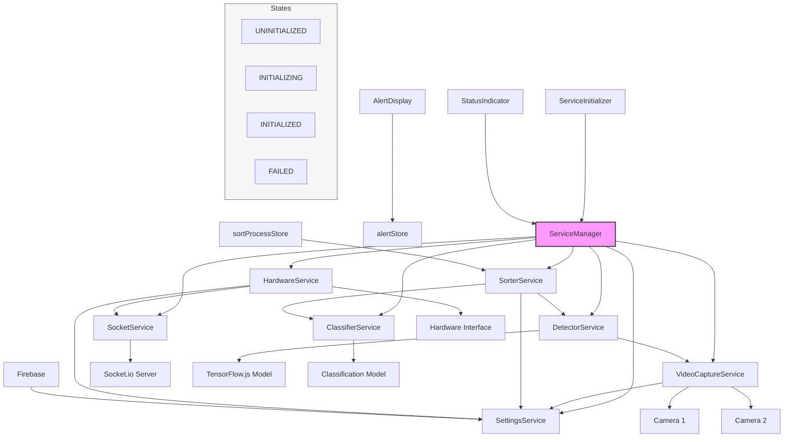

# Rebrick Sorter System Architecture

## Overview

The Rebrick Sorter is a sophisticated system designed to automatically detect, classify, and sort Lego bricks using computer vision and machine learning. The application is built using Next.js and follows a service-oriented architecture pattern.

## System Components

### Core Services

1. **ServiceManager**

   - Central hub that manages all service lifecycles
   - Handles initialization and state management of all services
   - Provides access to services throughout the application

2. **SettingsService**

   - Manages application settings
   - Integrates with Firebase for settings persistence
   - Provides configuration for other services

3. **SocketService**

   - Manages WebSocket connections using Socket.io
   - Enables real-time communication with hardware
   - Handles connection state and reconnection logic

4. **VideoCaptureService**

   - Controls dual camera system
   - Captures video streams from two cameras
   - Depends on SettingsService for camera configuration

5. **DetectorService**

   - Processes images to detect Lego pieces
   - Uses TensorFlow.js for object detection
   - Depends on VideoCaptureService for image input

6. **ClassifierService**

   - Classifies detected Lego pieces
   - Integrates with machine learning model
   - Works in conjunction with DetectorService

7. **HardwareService**

   - Interfaces with physical sorting hardware
   - Depends on SocketService for communication
   - Depends on SettingsService for hardware configuration

8. **SorterService**
   - Controls the overall sorting process
   - Coordinates detection, classification, and hardware control
   - Depends on DetectorService, ClassifierService, and SettingsService

### UI Components

1. **ServiceInitializer**

   - Initializes all services on application startup
   - Manages service initialization sequence
   - Provides loading state during initialization

2. **StatusIndicator**

   - Displays real-time status of all services
   - Shows service states (UNINITIALIZED, INITIALIZING, INITIALIZED, FAILED)
   - Allows manual service reinitialization

3. **AlertDisplay**

   - Shows system alerts and notifications
   - Integrates with alertStore for state management

4. **NavBar**
   - Provides navigation and system controls
   - Displays system status

### State Management

- **alertStore**: Manages system alerts and notifications
- **sortProcessStore**: Controls sorting process state
- **Firebase**: Persists application settings
- **Service States**: Each service can be in one of four states:
  - UNINITIALIZED
  - INITIALIZING
  - INITIALIZED
  - FAILED

### External Integrations

1. **Machine Learning**

   - TensorFlow.js for object detection
   - Custom classification model for Lego piece identification

2. **Hardware Interface**
   - Socket.io server for real-time hardware communication
   - Dual camera system
   - Physical sorting mechanism

## System Architecture Diagram

## Service Initialization Flow

1. Application starts and ServiceInitializer component is mounted
2. ServiceManager begins initialization of all services in sequence
3. SettingsService initializes first, connecting to Firebase
4. SocketService establishes WebSocket connection
5. VideoCaptureService initializes camera connections
6. DetectorService loads TensorFlow.js model
7. ClassifierService prepares classification model
8. HardwareService establishes hardware communication
9. SorterService initializes last, coordinating all other services

## Error Handling

- Each service implements error handling and state management
- Services can fail gracefully and attempt reinitialization
- Errors are propagated to the UI through the alertStore
- Status changes are reflected in the StatusIndicator component

## Development Guidelines

1. **Service Implementation**

   - All services must implement the Service interface
   - Services should handle their own state management
   - Dependencies should be clearly defined
   - Error handling should be comprehensive

2. **UI Components**

   - Components should be reactive to service states
   - Use status indicators for service state visualization
   - Implement error boundaries where appropriate

3. **State Management**

   - Use appropriate stores for state management
   - Maintain clear state update patterns
   - Document state dependencies

4. **Hardware Integration**
   - Follow hardware communication protocols
   - Implement proper error handling for hardware failures
   - Document hardware dependencies and requirements
