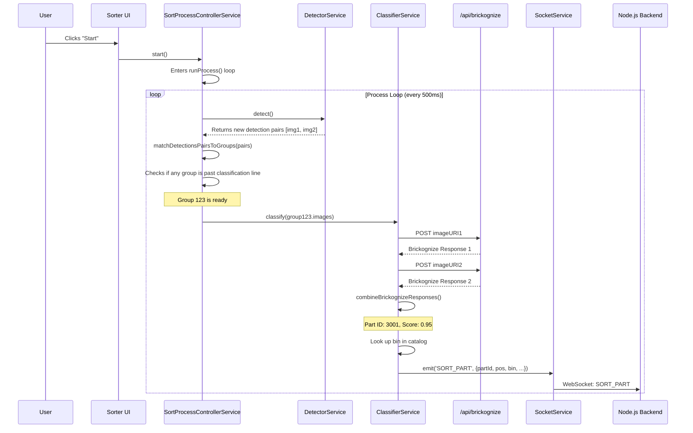

# Frontend Architecture: Rebrick Sorter

## 1. Overview

This document provides a detailed breakdown of the frontend architecture for the Rebrick Sorter project. The frontend is a Next.js web application that serves as the primary user interface for monitoring the sorting process, controlling the hardware, and managing system settings.

Crucially, the frontend is not just a "dumb client." It runs a significant portion of the core logic, including real-time object detection using a local TensorFlow.js model. It is responsible for identifying a LEGO part's presence and location on the conveyor belt, initiating the classification process, and then handing off the final sorted part data to the backend server for hardware execution.

This document is intended to provide context to developers and LLM-based coding assistants to facilitate future development and maintenance.

## 2. Technology Stack

The frontend is built with a modern, reactive technology stack:

- **Framework:** [Next.js](https://nextjs.org/) (with App Router)
- **Language:** [TypeScript](https://www.typescriptlang.org/)
- **UI Library:** [React](https://reactjs.org/)
- **Styling:** [Tailwind CSS](https://tailwindcss.com/)
- **UI Components:** [shadcn/ui](https://ui.shadcn.com/)
- **State Management:** [Zustand](https://github.com/pmndrs/zustand)
- **Real-time Client/Server Communication:** [Socket.IO Client](https://socket.io/docs/v4/client-api/)
- **Cloud Integration:** [Firebase SDK](https://firebase.google.com/docs/web/setup) (for Firestore and Storage)
- **Machine Learning:** [TensorFlow.js](https://www.tensorflow.org/js) (for in-browser object detection)

## 3. Project Structure

The frontend code is primarily organized across the following directories:

- `app/`: Contains the pages and routing logic, following the Next.js App Router structure. Key pages include the main sorter interface (`/sorter`) and the settings page (`/settings`). It also hosts the backend API proxy for Brickognize (`/api/brickognize`).
- `components/`: Houses all reusable React components, from basic UI elements (`/ui`) to complex compound components like `DualVideo.tsx` and `ServiceInitializer.tsx`.
- `lib/`: A critical directory containing the core logic and services.
  - `lib/services/`: Implements a client-side service-oriented architecture, with individual services managing specific functionalities (e.g., `SocketService`, `DetectorService`).
  - `lib/firebase.ts`: Firebase initialization code.
- `hooks/`: Contains custom React hooks, such as `useSocket.ts` for interacting with the Socket.IO service.
- `stores/`: Defines the global state management stores using Zustand (e.g., `sortProcessStore`, `alertStore`).
- `public/`: Stores static assets, most importantly the `detection-model/` which contains the local TensorFlow.js object detection model.

## 4. Core Architectural Patterns

### 4.1. Client-Side Service Layer

The most important architectural pattern is the use of a **service layer** on the client side. This abstracts complex logic into manageable, singleton-like services that can be initialized and used throughout the application.

- **`Service.interface.ts`**: Defines a common interface for all services, requiring `init()` and `getStatus()` methods. This ensures a consistent lifecycle for all services.
- **`ServiceManager.ts`**: A singleton manager responsible for holding instances of all services and orchestrating their initialization.
- **`ServiceInitializer.tsx`**: A React component that wraps the main application layout and triggers `serviceManager.initializeAll()` on mount, ensuring all services are ready before the UI becomes interactive.

The key services are:

- **`SettingsService`**: Manages fetching and saving application settings from/to Firebase Firestore.
- **`SocketService`**: Manages the persistent WebSocket connection to the Node.js backend.
- **`VideoCaptureService`**: Handles access to the webcam video streams and provides a method for capturing frames.
- **`DetectorService`**: Loads the local TensorFlow.js model and performs object detection on captured video frames.
- **`ClassifierService`**: Manages the multi-step process of classifying a detected part, interacting with the Brickognize API (via a proxy), and looking up part data.
- **`SortProcessControllerService`** (in `SorterService.ts`): The central orchestrator. It runs the main processing loop, coordinating the detector, classifier, and state updates.

### 4.2. Global State Management with Zustand

For global state that needs to be accessed by multiple components and services, the application uses Zustand. It is lightweight and avoids the need for wrapping the entire app in context providers.

- **`sortProcessStore`**: The main store, which tracks the entire state of the sorting pipeline. This includes the list of detected part groups, conveyor speed, process status (`isRunning`), etc. Services and components can subscribe to this store to react to state changes.
- **`alertStore`**: A simpler store for managing a global queue of alerts to be displayed to the user.

## 5. Communication and Data Flow

The frontend communicates with several other systems, each with a distinct protocol and purpose.

### 5.1. Frontend <-> Backend (Node.js Server)

- **Protocol:** WebSockets, managed by `socket.io-client`.
- **Manager:** `SocketService.ts`.
- **Flow:** This is the primary channel for real-time control and status.
  - **Client -> Server:** The frontend emits events to control hardware. The most important is `SORT_PART`, which sends classified part data to the backend to be physically sorted. Other commands include manual controls for the conveyor, jets, etc.
  - **Server -> Client:** The backend streams status updates, such as hardware state (`INIT_HARDWARE_SUCCESS`), conveyor speed updates (`CONVEYOR_SPEED_UPDATE`), and confirmations (`PART_SORTED`).

### 5.2. Frontend <-> Firebase

- **Protocol:** HTTPS, managed by the Firebase Web SDK.
- **Flows:**
  1.  **Settings Management (`SettingsService`):** The application subscribes to a document in **Firestore** using `onSnapshot`. This allows for real-time updates of settings across different sessions or devices. Settings are saved back to the same document.
  2.  **Part Catalog (`ClassifierService`):** On initialization, the `ClassifierService` downloads a large, gzipped JSON file (`catalogData_v4.json.gz`) from **Firebase Storage**. This file contains the mapping from Part ID to its designated collection bin.
  3.  **Classification Logging (`ClassifierService`):** For data collection and future model training, after every successful classification via Brickognize, the `ClassifierService` uploads the cropped part image to **Firebase Storage** and saves a corresponding record in **Firestore** containing the image URL and the full response from Brickognize.

### 5.3. Frontend <-> Brickognize (Third-Party)

- **Protocol:** HTTPS.
- **Flow:** The communication is indirect, proxied through a Next.js API Route.
  1.  The `ClassifierService` has a cropped image of a part as a Base64 `dataURI`.
  2.  It sends this `dataURI` in a POST request to the application's own backend at `/api/brickognize`.
  3.  The API Route (a serverless function running on Vercel/Node.js) receives this request. It then makes a request to the actual Brickognize API, forwarding the image data.
  4.  This proxy approach is a best practice, as it keeps the Brickognize API key and any other sensitive details secure on the server side, preventing its exposure in the client-side code.

## 6. Key Workflow: The Part Detection & Classification Pipeline

This is the most complex process on the frontend, combining multiple services and communication channels.

**Step-by-step Breakdown:**

1.  **Initiation:** The `SortProcessControllerService` (SPCS) starts its `runProcess` loop.
2.  **Detection:** In each loop, it calls `DetectorService.detect()`. The `DetectorService` captures frames from the two webcams, runs them through the local TensorFlow.js model, and returns an array of detected part bounding boxes and image data.
3.  **Tracking:** The `SPCS` takes these new detections and matches them to existing "groups" of detections from previous frames. This allows it to track a single physical part as it moves across the conveyor belt.
4.  **Classification Trigger:** The `SPCS` constantly checks the position of the last detection in each group. When a group's leading edge passes a virtual threshold on the screen (e.g., 33% across the view), it triggers the classification process.
5.  **Classification:** The `SPCS` calls `ClassifierService.classify()`, passing the most recent images of the part from both camera views.
6.  **Proxy to Brickognize:** The `ClassifierService` sends these images, one by one, to the `/api/brickognize` proxy, which gets the classification result from the external Brickognize service.
7.  **Data Enrichment:** The `ClassifierService` combines the results from both views, assigns a final score, and if the score is high enough, it looks up the part's assigned bin and sorter location from the catalog data it loaded from Firebase.
8.  **Logging:** The classification result and image are saved to Firestore and Firebase Storage for logging.
9.  **Hand-off to Backend:** Finally, the `ClassifierService` calls `SocketService.emit()` to send a `SORT_PART` event to the main Node.js backend server. This payload contains everything the backend needs to execute the physical sort: the Part ID, its exact position and time of classification, and the target bin/sorter.
10. **Physical Sort:** The frontend's direct involvement in this part's journey is now complete. The backend takes over to schedule the air jet firing and sorter positioning.
